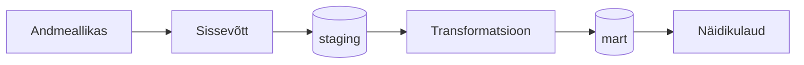

# [GRUPI NIMI] — Eesti andmete maht, terviklikkus ja uuenemine Open Food Facts andmebaasis

## Äriküsimus

Open Food Facts (https://world.openfoodfacts.org/) on avalik, vabatahtlike poolt täiendatav andmebaas, mis koondab rohkem kui nelja miljoni toidu pakendiandmeid 150 riigist. Projekti eesmärk on hinnata, kuivõrd esinduslik on Open Food Facts andmebaas Eesti puhul ning kas see oleks kasutatav rakenduste loomiseks ja teadustöö sisendina.

**Mõõdikud:**
1. Eestis müüdavate toodete koguarv andmebaasis
2. Lisanduvate toodete arv päevas
3. Andmete terviklikkus: toodete arv/osakaal, millel on olemas
	1) energia ja peamiste toitainete sisaldus,
	2) koostisosade nimekiri,
	3) pakendi materjal,
	4) kogus (netomass/ruumala vmt)
* Võimalusel arvutame mõõdikud ka tootekategooriate lõikes.

## Arhitektuur



Täpsem kirjeldus: [`docs/arhitektuur.md`](docs/arhitektuur.md)

## Andmestik

| Allikas | Tüüp | Ajas muutuv? | Roll |
|---------|------|--------------|------|
| OpenFoodFacts andmebaas | CSV| Jah, iga päev | Algne andmestiku laadimine |
| OpenFoodFacts delta loend | TXT | Jah, iga päev | Andmestiku uuendamine |
| OpenFoodFacts päeva delta | JSONL | Jah/Ei (iga deltafail eraldi on staatiline, aga iga päev lisandub uus fail) | Andmestiku uuendamine |

https://world.openfoodfacts.org/data
https://static.openfoodfacts.org/data/en.openfoodfacts.org.products.csv.gz (u 1GB, kogu andmebaas, pakitud CSV)
https://static.openfoodfacts.org/data/delta/index.txt (delta failide (JSONL) loend, viimased 14 päeva)
https://static.openfoodfacts.org/data/delta/{filename} (u 20MB, ühe päeva muudatused)

Täielik OpenFoodFacts andmestik on kursuseprojekti jaoks ebaproportsionaalselt suur (u 4.5M kirjet). Seetõttu filtreeritakse sissevõtu-etapis ainult Eesti toodetega seotud kirjed (u 4.5K), mis vähendab oluliselt lokaalset mälu- ja arvutusvajadust.

## Stack

| Komponent | Tööriist |
|-----------|---------|
| Sissevõtt | Python |
| Transformatsioon | dbt |
| Andmehoidla | PostgreSQL / pg_duckdb |
| Näidikulaud | Superset |
| Orkestreerimine | Airflow |

## Käivitamine

```bash
# 1. Klooni repo ja liigu kausta
git clone <repo-url>
cd <projekti-kaust>

# 2. Kopeeri keskkonnamuutujad
cp .env.example .env
# Muuda .env failis paroolid ja muud seaded vastavalt vajadusele

# 3. Käivita teenused
docker compose up -d --build

# Test-režiim
python ingest.py --mode test

# Produktsiooni režiim
python ingest.py --mode prod
```
Airflow: http://localhost:8080 (kasutaja: airflow / parool: airflow)
Näidikulaud: http://localhost:[PORT]

## Saladused ja konfiguratsioon

Kõik saladused (paroolid, API võtmed, andmebaasi URL-id) on `.env` failis. Repos on ainult `.env.example`, mis näitab vajalike muutujate struktuuri ilma tegelike väärtusteta. Päris `.env` faili ei tohi GitHubi panna - see on `.gitignore`-s.

Vajalikud muutujad:

| Muutuja | Tähendus | Näide |
|---------|----------|-------|
| `DB_PASSWORD` | PostgreSQL parool | (saladus) |
| `[teised]` | ... | ... |

## Andmevoog lühidalt

1. **Sissevõtt** — [Kirjelda, kuidas andmed allikast kätte saadakse]
2. **Laadimine** — Andmed laaditakse `staging` kihti
3. **Transformatsioon** — [Kirjelda peamised arvutused ja mudelid]
4. **Testimine** — [Mitu] andmekvaliteedi testi kontrollivad korrektsust
5. **Näidikulaud** — [Kirjelda lühidalt, mida näidikulaud näitab]

## Andmekvaliteedi testid

Projekt kontrollib järgmist:

1. [Test 1 - nt: kasutajate ID on unikaalne]
2. [Test 2 - nt: tellimuse summa pole null]
3. [Test 3 - nt: kuupäev jääb vahemikku 2020-2026]
[Lisa rohkem, kui sul on]

Testide tulemused: [kuhu salvestatakse / kuidas vaadata]

## Projekti struktuur

```
.
├── airflow/
│   ├── dags/
│   ├── logs/
│   └── plugins/
│
├── data/
│   ├── bootstrap/
│   ├── snapshots/
│   ├── deltas/
│   └── state/
│
├── dbt_project/
│   ├── models/
│   │   ├── staging/
│   │   ├── intermediate/
│   │   └── marts/
│   ├── macros/
│   └── seeds/
│
├── docs/
│   ├── arhitektuur.md
│   └── progress.md
│
├── ingestion/
│   ├── bootstrap/
│   ├── production/
│   ├── deltas/
│   └── common/
│
├── init/
│   ├── 01_create_schemas.sql
│   └── 02_extensions.sql
│
├── compose.yml
├── requirements.txt
├── README.md
├── .env.example
└── .gitignore
```

## Kokkuvõte, puudused ja võimalikud edasiarendused

**Kokkuvõte:**
- [Loetle, mis on lõpule viidud, mis töötab hästi]

**Puudused:**
- [Loetle ausalt, mis jäi tegemata - see ei mõjuta hinnet negatiivselt, vaid aitab hinnata]

**Mis edasi:**
- [Mida tahaksid edasi teha, kui aega oleks rohkem]

## Meeskond

| Nimi | Roll |
|------|------|
| [Karl Räim] | [Andmete sissevõtt] |
| [Maarja Kukk] | [Transformeerimine, kvaliteedikontrollid] |
| [Marge Saamel] | [Dokumenteerimine, andmete visualiseerimine] |
| [Anni Maire Maripuu] | [Kviteedikontrollid, andmete visualiseerimine] |